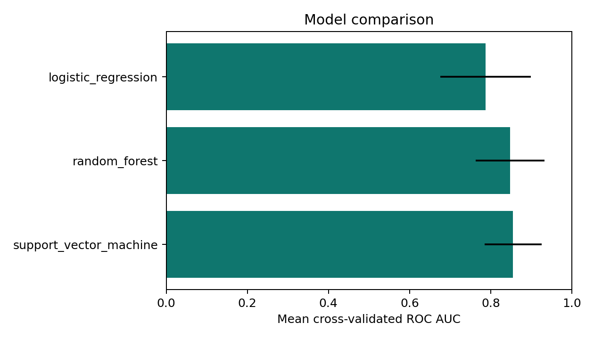
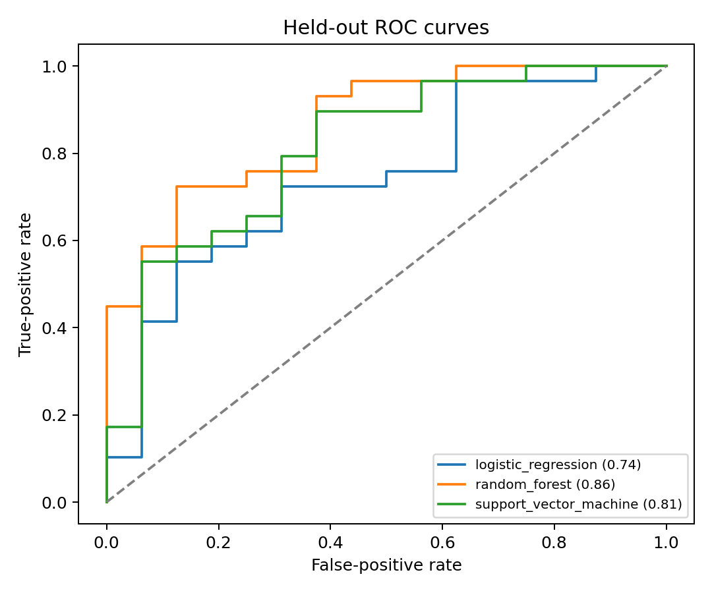
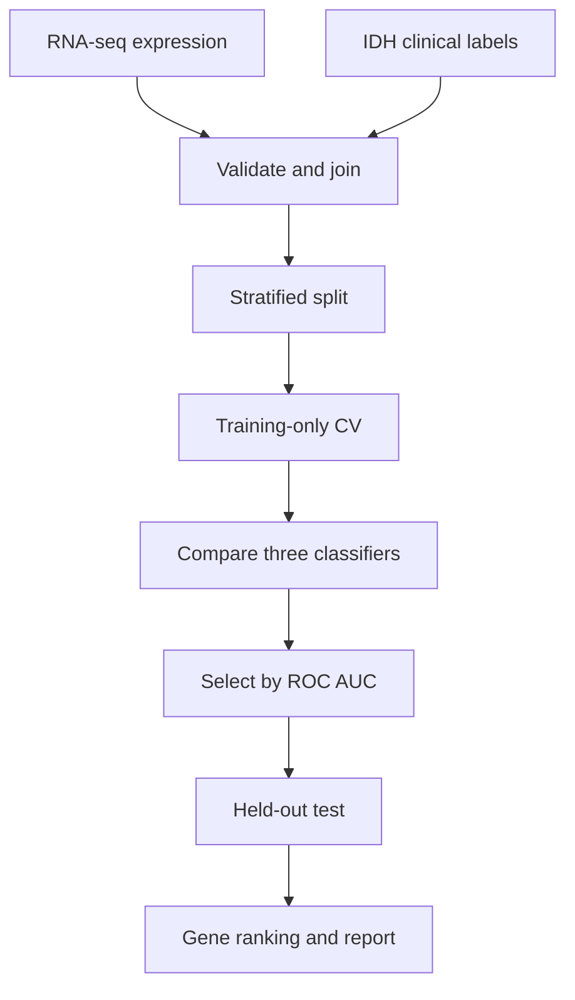

# Glioma IDH Classifier

[](https://www.python.org/)
[](https://scikit-learn.org/)

A complete bioinformatics and machine-learning workflow for predicting glioma isocitrate dehydrogenase (IDH) mutation status from bulk RNA-seq expression. It covers validated data integration, exploratory analysis, PCA, leakage-safe preprocessing, three-model comparison, stratified cross-validation, independent test evaluation, gene-level interpretation, figures, result tables, and automated reporting.

> **Research and education only.** This repository is not a diagnostic system. Synthetic demonstration results have no biological or clinical meaning. Any real-cohort result requires independent validation.

## Biological question

Can genome-wide RNA expression distinguish IDH-mutant gliomas from IDH-wild-type gliomas?

IDH status is central to modern glioma classification and is associated with substantial molecular differences. A high-performing expression classifier may recover those differences, but it does not replace validated molecular testing or establish that selected genes are causal.

## Project capabilities

- Reads CSV, TSV, and gzip-compressed tables
- Validates columns, unique sample IDs, class counts, and feature usability
- Matches molecular and clinical records explicitly
- Creates class-distribution, expression-distribution, and PCA figures
- Prevents preprocessing leakage by fitting transformations inside model pipelines
- Compares logistic regression, random forest, and support vector machine models
- Uses stratified training-only cross-validation for model selection
- Evaluates all candidates on a reserved test set
- Reports ROC AUC, average precision, balanced accuracy, precision, recall, and F1
- Calculates permutation-based gene importance for the selected model
- Saves a reusable fitted model, predictions, figures, tables, JSON, and Markdown report
- Provides a deterministic synthetic demonstration
- Includes automated baseline and end-to-end tests

## Example output

The repository includes a clearly labeled synthetic demonstration so reviewers can inspect the output format immediately. These plots do not describe real patients or real genes.





## Analysis design



## Repository structure

```text
.
├── analyze.py                 # Complete comparison and reporting workflow
├── train.py                   # Compact logistic-regression baseline
├── src/
│   ├── idh_model.py           # Input validation and baseline model
│   └── full_analysis.py       # EDA, CV, evaluation, interpretation, reporting
├── tests/
│   ├── test_pipeline.py
│   └── test_full_analysis.py
├── notebooks/
│   └── 01_complete_analysis.ipynb
├── examples/synthetic_demo/  # Versioned example figures and tables
├── data/                      # Local data, excluded from version control
├── requirements.txt
└── README.md
```

## Installation

```bash
git clone https://github.com/palrabheru/glioma-idh-classifier.git
cd glioma-idh-classifier
python -m venv .venv
```

Activate the environment:

```bash
# Windows PowerShell
.venv\Scripts\Activate.ps1

# macOS or Linux
source .venv/bin/activate
```

Install requirements:

```bash
python -m pip install --upgrade pip
python -m pip install -r requirements.txt
```

## Quick verification

Compact baseline:

```bash
python train.py --demo --output-dir outputs/baseline_demo
```

Complete analysis:

```bash
python analyze.py --demo --output-dir results/demo
```

Tests:

```bash
python -m pytest -q
```

## Required input data

### Expression matrix

The analysis expects samples as rows and genes as columns:

| sample_id | IDH1 | OLIG2 | GFAP | ATRX |
|---|---:|---:|---:|---:|
| TCGA-XX-0001 | 5.24 | 7.11 | 3.82 | 4.19 |
| TCGA-XX-0002 | 4.87 | 2.16 | 8.04 | 3.71 |

All gene columns must be numeric or convertible to numeric. Completely missing gene columns are removed. Transpose gene-by-sample matrices before running the pipeline.

### Clinical labels

| sample_id | idh_status |
|---|---|
| TCGA-XX-0001 | Mutant |
| TCGA-XX-0002 | Wildtype |

The identifier column must be unique in both files. Recognized positive labels include `1`, `true`, `yes`, `mutant`, `mutated`, `idh-mutant`, and `idh_mutant`. Pass `--positive-label` for any other terminology.

## Run a real cohort

```bash
python analyze.py \
  --expression data/processed/gbmlgg_expression.tsv.gz \
  --clinical data/processed/gbmlgg_clinical.tsv \
  --sample-column sample_id \
  --target-column idh_status \
  --positive-label Mutant \
  --top-k 75 \
  --test-size 0.25 \
  --seed 42 \
  --output-dir results/tcga_gbmlgg
```

## Preprocessing and leakage control

Every candidate model includes the complete transformation sequence:

1. Median imputation
2. Zero-variance filtering
3. ANOVA selection of the top `k` genes
4. Standardization
5. Class-balanced classification

These steps are fitted independently inside each training fold. Performing gene selection before splitting would allow test-set information to affect the model and inflate performance.

## Compared models

| Model | Role | Important consideration |
|---|---|---|
| Logistic regression | Interpretable linear baseline | Assumes an additive linear decision boundary |
| Random forest | Nonlinear ensemble | Can model interactions but may overfit small cohorts |
| RBF support vector machine | Flexible kernel baseline | Requires scaled features and careful external validation |

The selected model is the one with the highest mean training-set cross-validated ROC AUC. All models are also evaluated on the same untouched test set for transparent comparison.

## Output structure

```text
results/demo/
├── REPORT.md
├── analysis_summary.json
├── best_model.joblib
├── figures/
│   ├── class_distribution.png
│   ├── model_comparison.png
│   ├── pca_by_idh_status.png
│   ├── precision_recall_curves.png
│   ├── roc_curves.png
│   ├── sample_expression_distribution.png
│   └── top_gene_importance.png
└── tables/
    ├── cross_validation_results.csv
    ├── permutation_importance.csv
    └── test_predictions.csv
```

## Metric interpretation

- **ROC AUC:** probability that the model ranks a randomly chosen mutant sample above a randomly chosen wild-type sample.
- **Average precision:** precision-recall summary, useful when the classes are unequal.
- **Balanced accuracy:** average recall across the two classes.
- **Precision:** reliability of positive predictions.
- **Recall:** fraction of mutant samples identified.
- **F1:** harmonic mean of precision and recall.

Do not rely on accuracy alone, particularly if one IDH class is much more common.

## Gene importance

Permutation importance is calculated on the held-out test data for the model selected by cross-validation. A gene receives greater importance when shuffling it causes a larger reduction in ROC AUC. This method is model-aware but still has limitations: correlated genes may substitute for each other, importance can vary across splits, and prediction does not demonstrate biological causation.

## TCGA GBMLGG considerations

- Match aliquots to patients deliberately and avoid patient overlap across splits.
- Define whether the analysis includes lower-grade glioma, glioblastoma, or both.
- Confirm IDH labels from appropriate clinical or molecular fields.
- Investigate tumor grade, histology, age, and batch as possible confounders.
- State the expression unit and transformation, such as log-transformed TPM.
- Do not combine differently processed matrices without an explicit harmonization plan.

## Reproducibility checklist

- Fixed random seed stored in output metadata
- Stratification used in cross-validation and test splitting
- Preprocessing learned only from training observations
- Per-sample predictions retained
- Cross-validation mean and standard deviation saved
- Machine-readable and human-readable reports produced
- Minimal dependency list provided
- Synthetic results labeled clearly

## Limitations and future work

- Add a fully documented TCGA data-preparation workflow.
- Use patient-grouped splitting for repeated specimens.
- Add nested cross-validation for hyperparameter selection.
- Quantify uncertainty with repeated splits or bootstrap intervals.
- Compare RNA-only models with clinical and molecular covariates.
- Evaluate calibration, threshold selection, and decision utility.
- Validate the final model on an independent glioma cohort.
- Perform enrichment analysis for stable high-importance genes.
- Compare expression-based predictions with direct molecular assays.

## Responsible interpretation

A classifier may learn tumor grade, tissue composition, batch, or cohort-specific processing rather than IDH biology. High internal performance is therefore a reason to investigate confounding and external generalization, not a reason to claim diagnostic readiness.

## License

No license has been selected yet. Add one before redistribution or reuse.
